---
title: "Diversification Under Market Inefficiency, an NLP Approach"

author:
- Robert Brink
- Marcus Gawronsky
- Christopher Kleyweg
- Ryan Kruger

date: 22 October 2018
geometry: "left=28mm,right=28mm,top=28mm,bottom=28mm"

abstract: A recent topic of interest in the realm of financial research has been the use of Artificial Intelligence (AI) in financial prediction. This paper explores the use of various techniques in the realm of Natural Language Processing (NLP) using a popular computational technique in deriving meaning from text data to analyse the relationship between company association and portfolio diversification for companies on the Johannesburg Stock Exchange (JSE). Using a novel take on the Word2Vec word embedding technique, we show the word-vector association between companies to track portfolio volatility over time.  

---  
\newpage
# Introduction  
 
The Capital Asset Pricing Model (CAPM) remains popular amongst financial professionals given its simplicity and ease of use. Central to the CAPM is the assumption of efficient markets, whereby investors are able to fully diversify away unsystematic risk leaving systematic risk represented by Beta as the sole risk determinant [@Strugnell2011]. However, the concept of perfect diversification prescribed by the CAPM remains challenging in South Africa or similar markets which exhibit low forms of efficiency. This leads to an underestimation of risk by South African investors who may be misled in their investment decisions through the use of CAPM or its extensions. This paper, therefore, presents an alternative risk metric known as “Association Risk” which offers investors a way in which to determine the level of diversification of a given portfolio. This metric is devoid of the CAPM assumptions, using Natural Language Processing (NLP) techniques on qualitative news articles and analyst reports. This eradicates the problem of quantitative pricing data which may be unreliable or corrupted. Portfolios with lower levels of Association are shown to be more diversified, exhibiting lower levels of volatility and therefore lower levels of risk.
 
This paper is organised as follows: Section 2 reviews the literature on the Capital Asset Pricing Model (CAPM) and introduces the use of Natural Language Processing (NLP) in the Financial Domain. Section 3 details the methodology, data, computing environment and data preprocessing, model specification and experimental design. Section 4 contains the results of this study and is split into two main sections namely Portfolio ANCOVA and Portfolio ANCOVA with blocking. Finally, in Section 5, we summarise and conclude our findings.  Section 6 contains the Appendixes.  
 
# Literature Review
 
The Capital Asset Pricing Model (CAPM) developed by @Treynor1961, @Treynor1962, @Sharpe1964, @Lintner1965, @Mossin1966 and @Black1972 remains at the core of modern financial theory by providing investors with a framework in determining how the expected return of an investment is affected by its risk [@Strugnell2011].  
 
$$ \text{Expected Return} = r_{f} + \beta(r_{m} - r_{f})$$  
 
Where Expected Return is the expected returns of a share in the market, $r_{f}$ is the risk-free rate, $r_{m}$ are the returns of the market, and $\beta$ is a coefficient computed using Ordinary Least Squares Regression, under the assumption of normally distributed errors [@Strugnell2011].  

Under the CAPM, an asset may only earn a higher average return given an increase in exposure to a comprehensive market portfolio, as denoted by $\beta$, which should capture all systematic risk in the market [@LairdSmith2017]. However, given that the market portfolio, which should exist as the universe of all investable assets, is not identifiable in reality, a market index is used as a proxy. The performance of the CAPM is thus generally poor, especially in small economies such as South Africa where the Johannesburg Stock Exchange (JSE) All-Share Index is not nearly an acceptable proxy, especially in comparison to bigger market such as the S&P 500 [@Bhatnagar2006]. This leaves studies with a joint hypothesis problem, as researchers are unable to attribute error in their model estimates to either misspecification of the CAPM or the establishment of a valid market portfolio.  
 
If we consider the first hypothesis, around the misspecification of the CAPM, numerous papers have critiqued the model's reliance on the assumptions of normality and efficiency both of which have been extensively disproved on the JSE. In a paper by @Smith2005, strong evidence for the existence of leptokurtosis in market returns is presented. While this property is less pronounced in aggregate and over long periods of time, this artefact of market returns violates the common methodologies used in estimating the CAPM, resulting in an underestimate of long-tail down-side risk.  The question of market efficiency is contentious in the literature, given the complexity in determining its hypothesis.  While the findings of @Phiri2014 vary dramatically in their conclusions, the overwhelming evidence by @Smith2002, @Smith2005 and @VanHeerden2013  find the JSE to be, at most, weak-form efficient over the time periods 1990 to 2013.  This result presents a strong argument for the existence of a non-random error term in this model, violating its crucial assumption that systematic risk is the sole determinant of portfolio risk in a given market. These findings are supported by existing literature identifying unsystematic anomalies such as the Size [@Banz1981] and Value Effect [@Basu1983], both of which are shown to have reliable predictive power in estimating expected returns. These findings are supported in South Africa by similar research which demonstrates as many as nine characteristic-based stylized facts on the JSE, indicating strongly that returns from unsystematic risk exist [@Muller2012; @Kruger2014].  
 
While the application of the CAPM in South Africa may be inappropriate, there is a crucial assumption it shares with many of its opponents, presented in @Muller2012 and @Kruger2014.  This assumption concerns the existence of a valid and cohesive market portfolio which may account for systematic risk.  This assumption has many lines of argumentation deeply explored within the South African literature. One primary criticism raised by researchers has been the ability for investors to construct such a diversified portfolio which samples investable assets to form a valid market proxy due to concerns of over cost, market concentration and liquidity [@Bradfield2004; @Kruger2008].  The second criticism relies on the ability for investors to construct a market portfolio which captures cohesive systematic risk. Given a universe of investable shares, cohesive systematic risk should only exist in cases in which the decision of a company’s listing is either random or consistent with a single predictor or set of correlated predictors. While this idea of common systematic risk does not  rely on common exposure to a particular economy, it is true that divestment by JSE listed companies in the South African economy, the “post-1994” privatization of state-owned companies and the popularity of dual listings have radically altered the idea and relevance of common systematic risk over a long period on the exchange.  In a paper by @Page1986, Mining and non-Mining sectors were shown on the JSE to be either negatively or uncorrelated and strong predictors of expected returns, rendering Market Beta either insignificant or underestimated across sectors of the exchange.  
 
The use of Market Capitalization-Weighted Indexes is shown to be ubiquitous in the realm of Quantitative Finance.  While many approaches exist to correct for known criticisms to this approach, there exist a number of common underlying assumptions which persist.  Weighted indexes assume that companies express systematic risk through a function of market capitalisation on an index, that systematic risk is cohesive and that through some weighted-sum of company returns systematic risk can be isolated from unsystematic risk.  While approaches by @Page1986, @Venter1992, @Bowie1993, @VanRensburg1997 and @VanRensburg2002 suggest the second assumption of Capitalization-Weighted Indexes an inappropriate assumption for the JSE, they provide arguing approaches as for how best to discreetly segment the market to correct for the assumption of cohesive systematic risk to cater for either negatively or uncorrelated sources of risk on the exchange.  
 
While the use of sector-derived indexes over a cohesive market index may appear nominal, this approach presents a drastic departure from the traditional specification of systematic risk in the CAPM and other financial models.  These alternatives correct for the problems of incohesive or uncorrelated systematic risks on the JSE, by allowing for a multitude of systematic risks computed according to company sector.  These papers suggest various methods for constructing and evaluating sector indexes defined according to market correlation and the identification of “core-business”. However, these papers are found to vary in their findings as to which index or definition is most appropriate for classifying a company into a particular sector index.  Thin-trading, existing anomalies and market microstructure on the JSE obscure these sectors when applying correlation-based techniques, and the strong presence of conglomerates which hold investments across a range of business activities make discrete classifications of company sectors challenging.  The idea of a particular company’s “core-business” changes over time and while on aggregate their definitions may be established, it is difficult to argue that these definitions would not vary according to the personal opinion of various researchers and analysts.  The idea of company “core-business” risk is continuous.  Many companies contain varying levels of exposure to many, often uncorrelated markets or sectors.  Given a  continuous mapping of companies to some concept of  “core-business” risk, the problem of index heterogony could be solved using a human understanding of company industry and primary risk.  In order to achieve this continuous mapping, these papers would require an appropriate, understandable and unbiased measure of company similarity which is not subject to anomalies and market microstructure.  Therefore, this metric needs to be computable, should respond to new information as well as rely on a human-like understanding of the world in order to be robust in a way which models human behaviour over time. While these sector definitions rely only on definitions of “core-business” and correlation, it is unclear as to why they should not include factors such as exposure to various risk factors, sentiment or association in order to capture a more robust understanding of primary risk.

Natural Language Processing (NLP) is the application of computational techniques to the analysis and synthesis of natural language in the form of either text or voice data, as opposed to synthetic languages used by computers and researchers. Research into NLP has grown substantially in recent years with the demand of industry and the interest amongst companies into automated chat, virtual assistants, document mining and machine comprehension alongside the growth of new techniques, datasets and computing capacity [@OLeary2009; @Cortis2017; @Sohangir2018]. 

A central focus of NLP in the financial domain thus far has been sentiment analysis, providing hedge fund managers with a tool in efficiently processing information and hence the ability to profit on potential market inefficiencies [@Engelberg2008]. In practice, however, using sentiment analysis to predict stock prices has shown limited success as ambiguity and implicit sentiment remain challenging for computer algorithms to interpret. While NLP tools may not be exceptionally accurate at predicting sentiment, they are extremely good at making associations between words and their contexts in text data. The problem with association-based metrics has been the difficulty of extracting association from large datasets of news and research reports as many techniques that try to compute association do not scale to large corpora.  The Word2Vec algorithm scales on text data thanks to its feed-forward neural network re-parameterisation and use of negative sampling. We propose a technique which derives an association-based portfolio risk metric using unstructured data, consisting of both news articles and analyst reports.    
 
With the increasing application of  “black-box” models in Empirical Finance there exists a growing need for model validation and explainability [@Ding2015; @Cortis2017]. Validation which relies on alternative data can be considered the truest extension of backtesting in cases where primary data may be unreliable or corrupted. During periods of extreme market inefficiency, markets can no longer be considered an accurate reflection of all public or privately held information, as proposed by the Efficient Market Hypothesis (EMH). This presents major concerns for investors who rely on price information to quantify long-term portfolio risk. Assuming true information exists outside of the marketplace in traditional sources, such as qualitative news articles and analyst reports, the question then remains as to how one can then quantify that data in a manner which is free from individual bias and computable in a way that allows an analyst still to estimate and measure long-term portfolio risk.  
 
By computing a smooth mapping of companies into a vector-space, this paper presents an unexplored use-case for NLP using the Word2Vec algorithm. Using word-vectors, we compute a measure of portfolio risk based on the association between companies within a portfolio on the JSE to evaluate its level of diversification under extreme market inefficiency.  
 
 
 
# Methodology  
 
This paper presents the case for computing a representation of a company’s primary risk factors based on processed text data in the form of news articles and analyst reports.  For a company, primary risk factors can only be identified through access to and synthesis of all public and privately held quantitative and qualitative information. While quantitative information such as company Financial Statements, Market Surveys, and Macroeconomic Data are invaluable sources of primary data, they can only be understood through a deep understanding of their meaning and incorporation in a causal, behavioural and human-derived model of the world.  News and analyst reports aim to harbour relevance through the search and synthesis of this qualitative and quantitative data.   Only through this synthesis can one begin to provide insight into company-specific exposure to primary risk factors.  For businesses, their proximity informs their primary risk factors.  Companies discussed in the context of Mining, for example, should contain vastly different characteristics to other companies discussed in other contexts as their proximity to information differs dramatically.  These companies should present varying sources of unsystematic risk based on this information and should serve as a tool in managing unsystematic risk through diversification.  

Information in articles and analyst reports is represented primarily and on aggregate through words. The meaning of these words is primarily informed by the context those words find themselves in.  Words discussed in similar contexts contain similar meaning. The Word2Vec algorithm assumes this important property of words and context to learn a mathematical representation of words based on the context which surround them, known as a skip-gram [@Mikolov2013b]. By computing vector representations of companies based on the words they are most proximal to, we can compute a vector representation of the information which surrounds them and begin to infer the primary risk factors which emerge in the human synthesis of public information.  When compared to similar techniques in NLP the joint use of Term-Frequency Inverse-Document-Frequency Weighting (TFIDF) and the Word2Vec algorithm provide clear advantages in computational efficiency, interpretability, and scalability.  Algorithms such as Latent Semantic Indexing (LSI), Latent Dirichlet Allocation (LDA) and Doc2Vec require large matrix factorisation, human interpretation, labelling and issues in term-weighting adding to the bias and difficulty in their use. Definitions of the techniques mentioned above can be found in Appendix A. These algorithms have been benchmarked in Appendix B against a dataset of company descriptions using t-distributed Stochastic Neighbour Embedding (t-SNE) and Scaling by Majorizing a Complicated Function (SMACOF). Even if these methods are considered computational efficient, they do not meet the requirements or intuitions of most analysts and can be considered inappropriate for this study. 

For investors, a primary assumption of risk modelling is in the homogeneity of market properties over time.  While prices may be random, many investors assume the variance of and covariance between shares indicate some common exposure to or nature of unsystematic risk.  This reliance on price and assumption of time homogeneity is a crucial assumption in all of Finance which breaks down under conditions of extreme market inefficiency. In the case of the 2010 “Flash Crash”, share prices fell an average of 9\% in the space of 36 minutes violating many of the assumptions in portfolio modelling and investment [@Borkovec2010].  Under these extreme market conditions market prices no longer provide a valuable medium and long-term insight into market properties, even where clear historical evidence exists as information contained in news articles and reports is no longer incorporated into price as implied by the EMH.  

In order to incorporate this information, methods must look to primary sources directly in order to identify drivers of unsystematic risk.  The question for researchers then comes in identifying the most appropriate time-horizon over which prices and investors change their market position.  Long-term studies on the JSE on market liquidity indicate that even under the most extreme conditions investors require an average of 32.12 trading days to trade out of portfolio positions [@Villiers1996].  Given these findings, it is accurate to then argue this liquidity horizon as the most appropriate method for the testing of an alternative measure of portfolio diversification.

Typically in these crisis situations, recent information is most important in identifying the sources of unsystematic risk. While uses of transfer-learning and sample weighting may improve many methods, a 30-day window of historical analysts reports and news data serve as a computable and scalable window for use in long-term testing over large samples from the population of daily news. This method allows us to compute, on aggregate, an unbiased and efficient smooth mapping between companies and their total risk. In order to identify the viability of our technique as a tool for investors, we identify the relationship between these levels of association and portfolio diversification.
                
Using random initialising, this algorithm compares a word-vector to the sum of the vectors in its skip-gram to compute a given Cosine similarity.  Using negative sampling, this algorithm efficiently learns a vector representation of these words by sampling words inside and outside this moving skip-gram.  By relying on common company descriptions, we can create a TFIDF-weighted sum of word-vectors learned on our corpus to predict a company or document-vector, robust to both error and the undersampling of news on particular companies.  In order to test our NLP derived measure for quantifying firm-characteristics and their application in portfolio diversification, we analyse the relationship between our metric of association based on historical news and analyst reports against future portfolio volatility.  By controlling for firm-specific volatility characteristics, we compare our historic measure of diversification against the covariance term of the Variance Sum Rule, which corrects for the covariance between shares. For detailed explanations of skip-grams and negative sampling see Appendix A. 
 
## Data  
This paper relies on a corpus of 250 000 news articles obtained from multiple online sources as shown in Appendix C. These websites were scraped for articles containing a predefined dictionary of company names of companies on the JSE seen in Appendix D.  Articles were scraped as at 12 July 2018, using the Scrapy HTML parsing library and stored in comma-separated files.  The articles were then grouped by their day of issue before being grouped into sets of 30-day news cycles, ensuring the proper alignment of calendar days against trading days.
 
Price data was sourced using the Reuters Datastream Service from companies on the JSE between 16 May 2003 and 17 May 2018. Total Index Return, an all-encompassing measure of returns which incorporates the dividends earned by stocks into the return metric, was used as a robust measure of price in order to account for the effect of dividend payments.  
 
$$ \text{Total Index Return} = \frac{P_{i,t} + D_{i,t}}{P_{i, t-1}} $$

Where $P_{i,t}$ is the price a given share, $i$, at some time,$t$, and $D_{i,t}$ is the dividend on a given share, $i$, at some time,$t$, and the $P_{i, t-1}$ the price of a given share, $i$, at some previous time,$t-1$.  
 
A total of 82 of the 174 JSE stocks were used due to the volume of articles for particular companies and access to reliable descriptions.  
 
\newpage  
## Computing Environment and Data Preprocessing   
 
|             | __Table 1: Python Computation__ |                        |  
|:-----------:|:----------------------:|:----------------------:|  
|   Software  |     Python 3.6         | Random seed of 42      |  
| Computation |    Dask Library        | 15 cores, 15 nodes and |
|             |                        | 30 gigabytes per node  |  
 
The details of the computation are detailed in Table 1. Articles were preprocessed by standardising the text to Unicode characters before transforming the text into lower-case and removing all punctuation and numeric characters.  The articles were also preprocessed to remove common stop words in this step to improve the stability and accuracy of our model given the size of the data set.  These stopwords were sourced from the common Scikit-Learn library and included words like “the’’, “their”, “then” and “a”, among others.

This study makes use of metadata tags of companies to address the challenge of creating vector representations of companies. For example, companies like “AngloGold Ashanti” are tagged to concepts such as “Mining” in order to ensure robust risk estimation of thinly-cited companies with few mentions in a given news cycle.  Company descriptions were sourced from Bloomberg for use as tags given the wide use and reliability of this service. One limitation of this study is that these descriptions remain unchanged over time while descriptions of companies may have changed during this time.  This use may skew the result of this research over periods where companies have radically changed the nature of their core operations or where these descriptions are inaccurate.

## Model Specification

A Continuous Bag-of-Words Word2Vec (see Appendix A) model was fitted over 30 iterations using a random seed of 1, a learning rate of 0.025 and a window of 5 and trained using a 30-day news-cycle to compute a numeric representation of all words in the corpus.  Using a description of each company, we take a weighted sum of each word’s numeric representation to compute numeric representations for each company according to the TFIDF of a dictionary of company descriptions. The companies are randomly assigned to 1000 random portfolios, each consisting of 15 stocks. On average, portfolios containing listed companies on the JSE require between 30-45 different shares to be considered well diversified and therefore exhibit low levels of unsystematic risk. Therefore portfolios of 15 stocks were chosen to best ensure the presence of unsystematic risk in order to test whether a relationship between association and volatility exists. Using this method we can compute a relative measure of diversification known as Association Risk.  A Cosine Distance metric is used to measure the similarity between vector-representations of companies within the portfolio.  This model assumes companies that are closer to one another in vector space to be similar. Association is therefore calculated as the inverse of the sum of the Cosine Distances between all document-vectors calculated from a given news window at some point in time. This metric of Association is then used as a measure of portfolio diversification and compared to the volatility of the portfolio over the next 30 days. In order to identify the viability of our technique as a tool for investors, we identify the relationship between these levels of Association and portfolio diversification. Backtesting is performed on a continuous rolling basis.

$$ \text{Association}=(\sum_{i=1}^{p} \sum_{j=1}^{p} \text{similarity}_{i,j})^{-1} $$
 
$$ \text{similarity}_{i,j} = \cos(\theta) = {\mathbf{C}_{i} \cdot \mathbf{C}_{j} \over \|\mathbf{C}_{i}\| \|\mathbf{C}_{j}\|} = \frac{ \sum\limits_{k=1}^{n}{C_{i,k}  C_{j,k}} }{ \sqrt{\sum\limits_{k=1}^{n}{C_{i,k}^2}}  \sqrt{\sum\limits_{k=1}^{n}{C_{j,k}^2}} } $$

In the equation above $p$ represents the size of a given portfolio, $C$ represents a given document-vector representing a company and $k$ represents the $k$ 'th element of a vector.

Figure 1 presents a t-SNE manifold embedding of the Cosine Distances between our different company document-vectors. A portfolio of 5 different companies was chosen for illustrative purposes. From this diagram, we can see the edges between nodes representing the distances between different points in our portfolio. We expect that portfolios with longer edges to be more dissimilar and thus to have greater diversification based on their firm-specific attributes.  

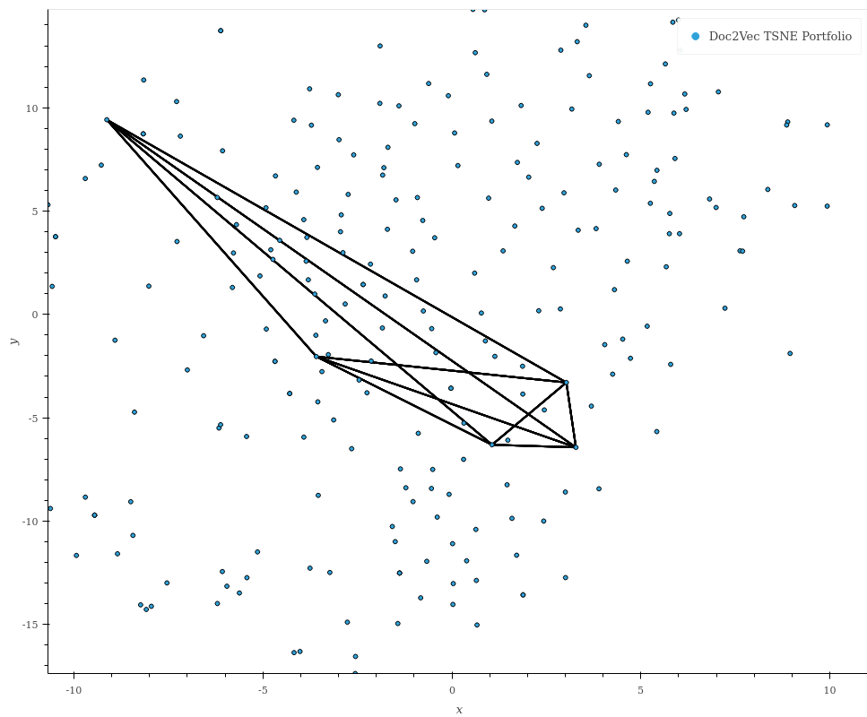  

__Figure 1: Association Computation Diagram__
  

## Experimental Design  
Our experimental design makes use of Analysis of Covariance (ANCOVA) in order to evaluate the relationship between Association and portfolio volatility.  
   
The Variance Sum Rule, shown below, allows us to compute portfolio variance based on the variance and covariance of shares in a portfolio.  
 
$$ \sigma_{p}^{2} = \sum_{i}^{n} \sigma_{i}^{2} + \sum_{i,j=1, i \ne j}^{n} \sigma_{i} \sigma_{j} cov_{i,j} $$
 
In this formula, we specify $n$ to be the number of shares in a portfolio, $\sigma_{p}$ to be the variance of the portfolio, $\sigma_{i}$ and $\sigma_{j}$ to be the variance of shares $i$ or $j$ in a given portfolio and $cov_{i,j}$ to be the covariance between shares $i$ and $j$ in the portfolio.  
 
While shares may exhibit particular variance properties as a function of their capital structure and operations, key in understanding the diversification of a portfolio is the ability to quantify covariance term specified below:  
 
$$\sum_{i,j=1, i \ne j}^{n} \sigma_{i} \sigma_{j} cov_{i,j}$$
 
In order to compare our forward-looking portfolio volatility to historical Association Risk, we will look to evaluate the relationship between the covariance term of the Variance Sum Rule to our computed $\text{Association}$.  Diversification aims to reduce the risk of a given portfolio, for a given level of return:  
$$\text{risk}_{p} \propto \frac{1}{\text{Diversification}_{p}} $$  

The aim of diversification is to include shares of different covariances to lower the risk in $\sigma_{p}$.  The Variance Sum Rule represents diversification through the term:  
$$ \sum_{i,j=1, i \ne j}^{n} \sigma_{i} \sigma_{j} cov_{i,j} $$  
 
In this paper we hypothesize $\text{Association}_{p}$ as a measure proportional to the level of diversification of a given portfolio, such that:  
$$ \sum_{i,j=1, i \ne j}^{i,j \in p} \sigma_{i} \sigma_{j} cov_{i,j} \propto \text{Association}_{p}$$  

And when combining these formulas and substituting back into the Variance Sum Rule, we get:
$$ \sigma_{p}^{2} = \sum_{i}^{n} \sigma_{i}^{2} + \sum_{i,j=1, i \ne j}^{n} \sigma_{i} \sigma_{j} cov_{i,j}  = \sum_{i}^{n} \sigma_{i}^{2} + f(\text{Association}_{p}) $$
 
Using this relationship, we can establish a model:  
$$ \sigma_{p}^{2} = \beta_{0} + \beta_{1} \text{Association}_{p} + \sum_{i \in P} \beta_{i}$$  
 
where $P$ are the items in a given portfolio which allows us to appropriately control for share-specific volatility, to determine:  
$$\text{Diversification}_{p} \propto \text{Association}_{p}$$  
 
Using the Student’s T-test, we can investigate the relationship between our Association Risk metric and diversification, under the Null Hypothesis:  
$$\beta_{1} = 0$$  
    
If this Null Hypothesis is true, then no relationship exists between our Association Risk metric and the diversification of our portfolio.  However, if:
$$\beta_{1} \ne 0$$  
 
Then,
$$\text{Diversification}_{p} \propto \text{Association}_{p}$$  
Allowing investors to use Association Risk as an accurate measure of portfolio risk.  
 
ANCOVA will be used to test this hypothesis under the assumption of normally distributed errors.  ANCOVA examines the influence of an independent variable on a dependent variable while removing the effect of the covariate factor.  It assumes a linear relationship between the dependent variable and the covariate factor. Given the use of continuous testing a time series plot of ANCOVA coefficients and p-values will be used to analyse the relationship between Association and portfolio volatility.   
    
$$ y_{i, j} = \mu + \tau_{i} + \beta (x_{i,j} - \bar{x}) + \epsilon_{i, j} $$  
    
 
- $Y_{i, j}$ is the covariate factor
- $u$ is the grand mean
- $\bar{x}$ is the global mean
- $x_{i, j}$ is the jth observation of the jth covariate factor
- $t_{i}$ is the variables fitted
- $\epsilon_{i, j}$ is the error term
 
This paper relies on price data in order to determine a proxy for long and medium-term portfolio risk as the concept of diversification cannot be observed directly.  If price data is inefficient, one key challenge in our experimental design is the reliance on this data in evaluating the correlation between Association Risk and long and medium-term portfolio risk.  Given this relationship we are presented with a joint-hypothesis problem, testing jointly whether prices are an efficient reflection of available information and whether Association Risk is an appropriate determinant of long and medium-term portfolio risk.  This presents two sources of variation in our study, which complicate our findings. While it may be impossible to control for price inefficiency in our study, we assume prices to be efficient on average using long sample periods and therefore determine the significance of Association Risk in determining portfolio risk in the long and medium-term.  
      
The application of ANCOVA relies on the appropriate identification of grand and global sources of variation.  Portfolios comprise many sources of volatility which arise due to market microstructure, market events and the inclusion of particular shares with high long-run volatility characteristics.  In order to explore the relationship between Association and portfolio volatility, we propose to investigate two methods in attributing and controlling for this error.  

The first method involves the use of multiple ANCOVA tests for the analysis of single portfolios over time. Under this method, we assume the variance term in the Variance Sum Rule to be included as some constant term, $\beta_{0}$, allowing for the direct comparison between Association Risk and portfolio volatility. This method, which we will refer to as “Portfolio ANCOVA”, relies on a key assumption, that the covariance term serves as the primary driver of portfolio risk over time. While this method presents many hypotheses for testing in this study, it includes all critical factors in relating portfolio diversification to Association Risk in a manner which is computationally efficient and avoids the need for the sampling of our data.    

This is tested for a given portfolio across time, using the equation:  
 
$$ \sigma_{p,t}^{2} = \beta_{0} + \beta_{1} \text{Association}_{p, t}$$   
 
in which a distribution of p-values is presented corresponding to the Null hypothesis of $\beta_{1, p} = 0$  for every portfolio, $p$, in our study.  

The second method aims to control for the primary sources of variation explicitly, by including $\beta_{t}$  and $\beta_{i}$ terms which control for exogenous sources of systematic volatility over time and the long-term volatility characteristic of particular companies included in a given portfolio, as part of the variance term in the Variance Sum Rule.  Given the 1000 sample portfolios and 2058 sample days in our study, sampling was used to aid in the computability of statistics across our ANCOVA study.  120899 data points were sampled under a range of initializations, in order to ensure accuracy under this method.  We specify a model:  
 
$$ \sigma_{p,t}^{2} = \beta_{0} + \beta_{1} \text{Association}_{p,t} + \beta_{t} + \sum_{i \in P} \beta_{i} $$  
 
for use in this second experiment, testing the null hypothesis $\beta_{1} = 0$ in order to investigate the relationship between Association Risk and portfolio variance, to evaluate its appropriate application of Association Risk in determining levels medium and long-term portfolio risk during periods of market inefficiency.  

    

# Results and Discussion  
## News Volume and Association  
    
In analysing news volume over time, in Figure 2, it is clear that the volume of news articles scraped before 2009 is extremely low. The word-vector associations over time detailed in Figure 3 appear constant, only displaying variance from 2008 onwards. This is due to the number of news articles used increasing dramatically during this period which remains a limitation of this study.  
 
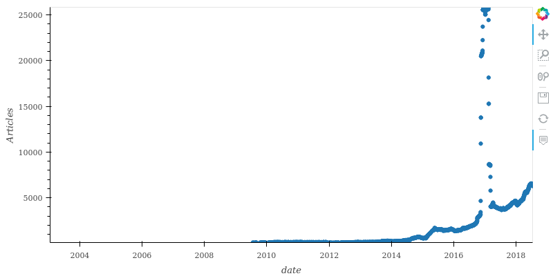  

__Figure 2: News Volume__
  
 
The volume plot seen in Figure 2 is related to the Association Plot in Figure 3 in that as news article volume increases so does the stability and accuracy of word-vectors used to compute Association.  
 
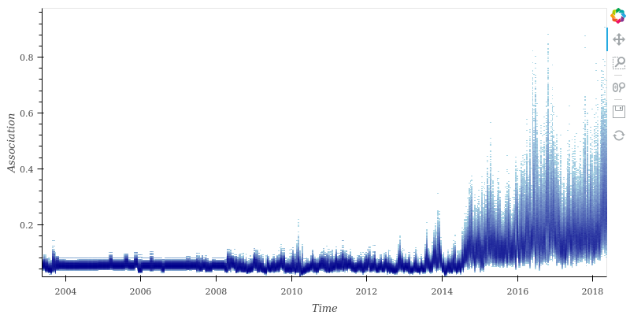  

__Figure 3: Association__
  
 
Volatility describes the standard deviation of portfolios over time. Figure 4 shows the 30-day volatility of returns across 1000 random evenly weighted portfolios between 16 May 2003 and 17 May 2018.  When assessing volatility over time, the influence of macroeconomic events such as the Financial Crisis in 2008 and the South African “Zuma-Gate Scandal” of 2016 are attributed to the spikes in portfolio volatility.  

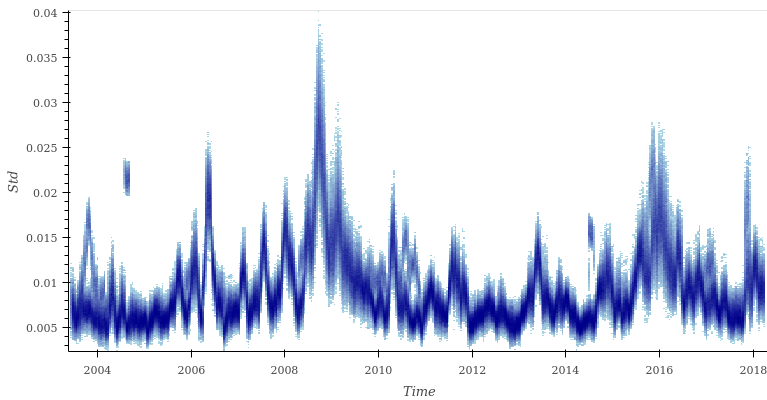  

__Figure 4: Volatility__

 
 
## Portfolio ANCOVA  
 
In analysing portfolios on an individual basis we hope to control for long-run company specific volatility characteristics, while avoiding the over-parameterisation of our model. Each data point on the plots indicates a portfolio estimated against separate models. These results are summarised in Table 2.

|                   | __Table 2__   |                   |            |  
|-------------------|---------------|-------------------|------------|  
| Dep. Variable     | y             | R-squared         | 0.068      |  
| Method:           | Least Squares | Adj. R-squared    | 0.068      |  
| No. Observations: | 2058          | F-statistic       | 150.8      |  
| DF Residuals:     | 2056          | Prob(F-statistic) | 1.70e-33   |  
| Df Model:         | 1             | Log-likelihood    | 9334.1     |  
| Covariance type   | non-robust    | AIC:              | -1.866e+04 |  
|                   |               | BIC:              | -1.865e+04 |  
|                   |               |                   |            |  
|                   | Coef          | std err           | t          |   
| constant          | 0.0075        | 0.000             | 72.687     |  
| X1                | 0.0114        | 0.001             | 12.279     |  
|                   |               |                   |            |  
|                   | p>\|t\|       | \[0.025           | 0.975\]    |  
| constant          | 0.000         | 0.007             | 0.008      |  
| X1                | 0.000         | 0.010             | 0.013      |  
|                   |               |                   |            |  

From the 2058 observations, we can observe a constant value of  0.0075 and an Association coefficient of 0.0114, both of which are significant at the 0.1\% level, with t-scores of  12.279 and 72.687 respectively.  This model demonstrates an $R^2$ value of 0.068 and joint-significance of 150.8 which is significant at the 0.1\% level using Fisher’s F-statistic. While these results may be significant, the $R^2$ value in this model is relatively weak with only 6.8% of the variation in volatility being explained by Association.  When observing the coefficients on Association Risk, in Figure 5, it is clear that they are normally distributed and lie in a reasonable range of positive values which suggests that the model is significant.  The same can be said for the ANCOVA constant x-values which exhibit similar traits, in Figure 6.  
 
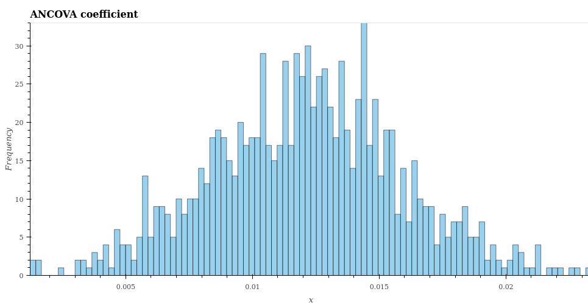    

__Figure 5: Coefficients Across Time Within Portfolios__
  
   
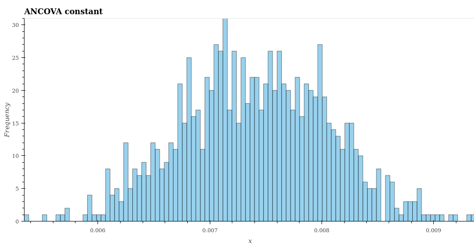

__Figure 6: Constants Across Time Within Portfolios__
  

The coefficient p-value plot, in Figure 7, shows that the coefficient on Association Risk for a given portfolio across time is significant at the 0.1\% level with a small minority of portfolios significant at the 0.5\% level. This is sufficient evidence to reject the null hypothesis and conclude that $\beta_{1}$ is not equal to 0.  If $\beta_{1}$ is not equal to 0, a relationship exists between Association Risk and portfolio volatility presenting evidence for its use as a predictor of portfolio diversification and our hypothesis in this study. 

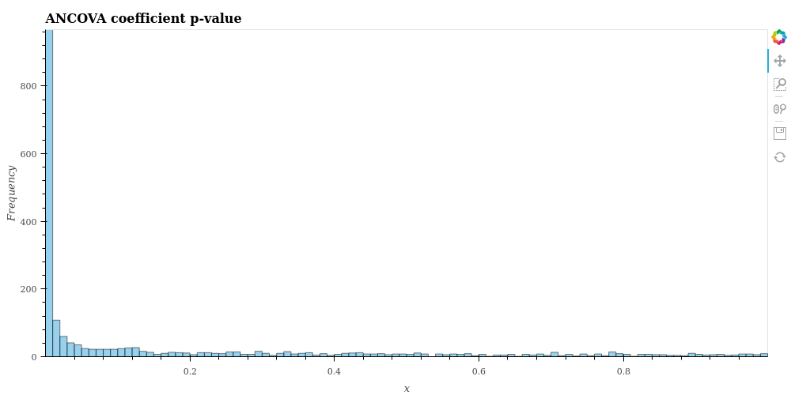  

__Figure 7: Coefficient P-values Across Time Within Portfolios__
  
 
In order to understand why these results may be significant, we analyse the distribution of a single portfolio over time looking at the 500th portfolio, chosen randomly, to assess Association and its relationship to portfolio volatility. Despite the long-tail distribution of volatility, Figure 8 demonstrates a clear positive relationship between Association Risk and portfolio volatility.  While the distribution of Association Risk obscures the presence of heteroskedasticity, the simplicity and under-parameterisation of this model suggest that Association Risk finds poor application as the sole predictor of volatility without controlling for market events and short-term company-specific volatility characteristics in which excess volatility of a single share contributes excessively to portfolio variance.

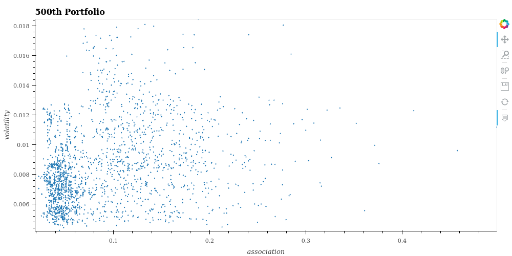  

__Figure 8: Scatter Plot of Association and Volatility of the 500th Portfolio__
    
 
From Figure 9 below, the normality of portfolio residuals can be observed confirming the validity in our assumption of normally distributed errors.  
 
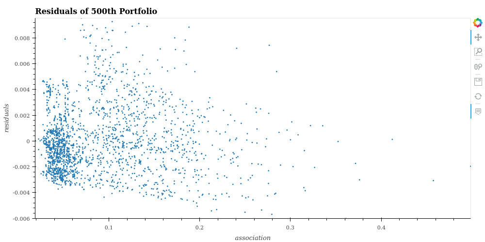

__Figure 9: Scatter Plot of Association and Residuals of the 500th Portfolio__
  

 
## Incorporation of Blocking  
 
This paper proposes a second method using blocking to control for the impact of exogenous market shocks and short-term company-specific events which may contribute greatly to portfolio variance. Using data on shares in our portfolios we propose a model to test for these sources of variation jointly, shown in the equation below:  
$$ \sigma_{p,t}^{2} = \beta_{0} + \beta_{1} \text{Association}_{p,t} + \beta_{t} + \sum_{i \in P} \beta_{i} $$  
 
Where $t$ represents a trading day in our dataset and $P$ represents a set of companies in a given portfolio. Given the number of data points, stratified sampling of our data was taken in order to fit this model using the Ordinary Least Squares method. These results are shown in Table 3.
    
\newpage  
|                   |  __Table 3__     |                   |            |  
|-------------------|------------------|-------------------|------------|  
| Dep. Variable     | y                | R-squared         | 0.794      |  
| Method:           | Least Squares    | Adj. R-squared    | 0.790      |  
| No. Observations: | 123450           | F-statistic       | 182.6      |  
| DF Residuals:     | 120899           | Prob(F-statistic) | 0.000      |  
| Df Model:         | 2550             | Log-likelihood    | 6.2152e+05 |  
| Covariance type   | non-robust       | AIC:              | -1.238e+64 |  
|                          |                                  | BIC:              | -1.213e+06 |                       
|                   |                  |                   |            |  
|                   | Coef             | std err           | t          |  
| Association       | 0.007            | 0.000             | 3.529      |  
| ...               |                  |                   |            |  
| Constant          | 0.0024           | 4.84e-06          | 500.510    |  
|                   |                  |                   |            |  
|                   | p>\|t\|          | \[0.025           | 0.975\]    |  
| Association       | 0.000            | 0.000             | 0.001      |  
| ...               |                  |                   |            |  
| Constant          | 0.000            | 0.002             | 0.002      |  
|                   |                  |                   |            |  
| Omnibus:          | 25356.151        | Skew:             | 0.933      |  
| Prob(Omnibus):    | 0.000            | Kurtosis:         | 7.402      |  
| Prob(JB):         | 0.000            | Cond. No.         | 1.72e+17   |  
|                   |                  |                   |            |  
| Dubin-Watson      | 1.999            |                   |            |  
| Jarque-Bera (JB): |117583.806        |                   |            |  
|                   |                  |                   |            |  
 

      
From the 120899 observations, we can observe a constant of  0.0024 and Association coefficient of 0.007, significant at the 0.1\% level. This coefficient value is far smaller in magnitude compared to the 0.0114 seen in the Portfolio ANCOVA method. The disparity between the coefficients on Association Risk between our two experiments appear large before considering the effects of sampling and omitted variable bias present between these two methods. Therefore, the size of a given coefficient does not indicate the magnitude of effect explored by this study.  Using p-values from the Student's T-test, we can test the relationship between Association Risk and portfolio volatility in order to determine its significance.  Under a Frequentist statistical paradigm, p-values represent the probability of obtaining a test statistic at least as extreme as the one from the data, assuming the model assumptions and null hypothesis are true, that the random variable is the same, and that the sample sizes are the same. The differences in p-values can, therefore, be attributed to different samples used across the two experiments. Omitted variable bias is defined as the bias of a model coefficient as the result of the omission of a variable from the unrestricted model.  When correlated variables are omitted from a statistical model, portions of the explained variance from the omitted variable can be inappropriately attributed to the remaining variables in the model, biasing their coefficients and skewing the significance found through their testing.  By excluding $\beta_{t}$ from our first experimental model, we bias the coefficient on Association Risk, as suggested by the heteroskedasticity in our first experiment.  

This model demonstrates an $R^2$ value of 0.794 and joint-significance of 182.6 which is significant at the 0.1\% level using Fisher’s F-statistic. Therefore, by incorporating blocking, this model is able to explain 79.4% of the variation in volatility due to Association when compared to only 6.8% without blocking. If we then analyse the residuals of this model, shown in Figure 10, we observe a similar distribution to that in Portfolio ANCOVA  being both symmetric and distributed around 0 with little correlation to Association as shown in Figure 10.  These findings provide validation for both models as these properties are crucial to the Gauss-Markov Assumptions and the use of these estimates as an unbiased linear estimator of portfolio variance. 

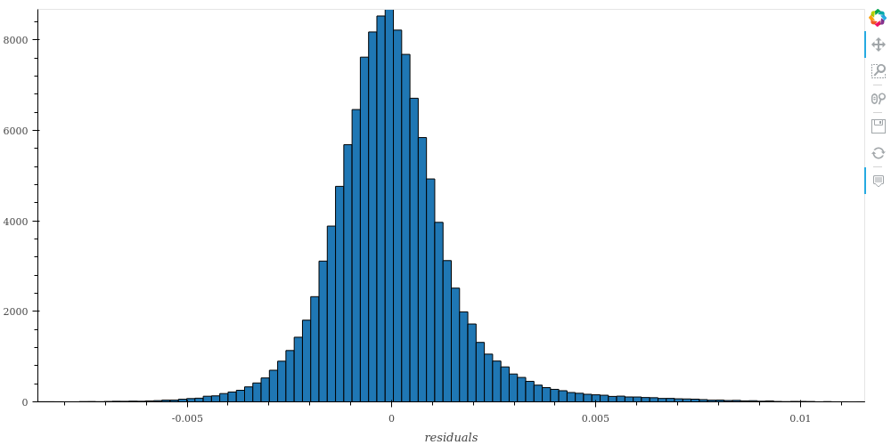  

__Figure 10: Histogram of Residuals for the Blocking ANCOVA__
  
 
The p-values of our date coefficient under the null hypothesis $\beta_{t} = 0$ are both significant and insignificant at points in time, suggesting the effect of exogenous shocks to our model as shown in Figure 11.  Despite these findings, we see that using blocking to control for a share’s excess volatility demonstrates significant p-values at the 0.001\% level using the Student’s T-distribution. This result, therefore, provides a strong argument for their use in this blocking design as shown in Figure 12. By finding significant p-values in both of our models, we are able to confirm our hypothesis of Association being inversely proportional to diversification and therefore directly proportional to risk. While we cannot comment on the magnitude of this effect, the results from our two studies demonstrate their relationship to be significant. For investors, this provides strong evidence and argument for the use of Association Risk as a proxy for portfolio volatility in times where pricing data may be a corrupt or a misleading indicator of medium or long-term portfolio characteristics. From the above results, we propose Portfolio ANCOVA with blocking to be a more accurate model in calculating portfolio diversification when compared to Portfolio ANCOVA without blocking and suggest this method to be used a base in future research.

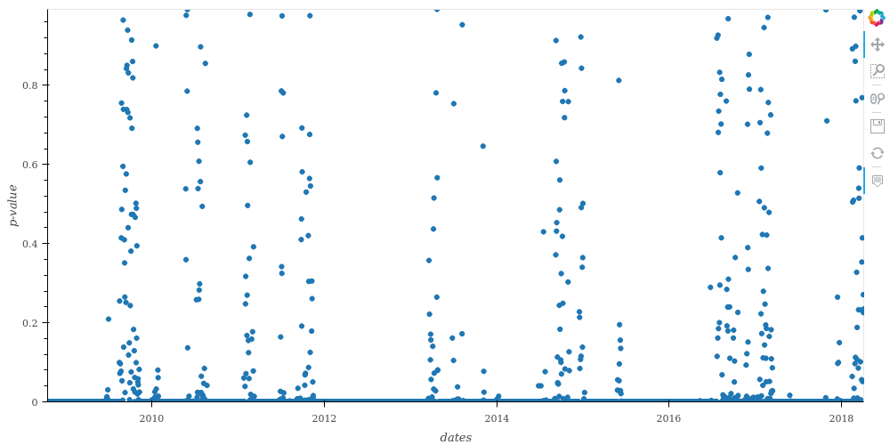  

__Figure 11: Scatter Plot of P-values for Dates of Blocking ANCOVA__
  
 
 
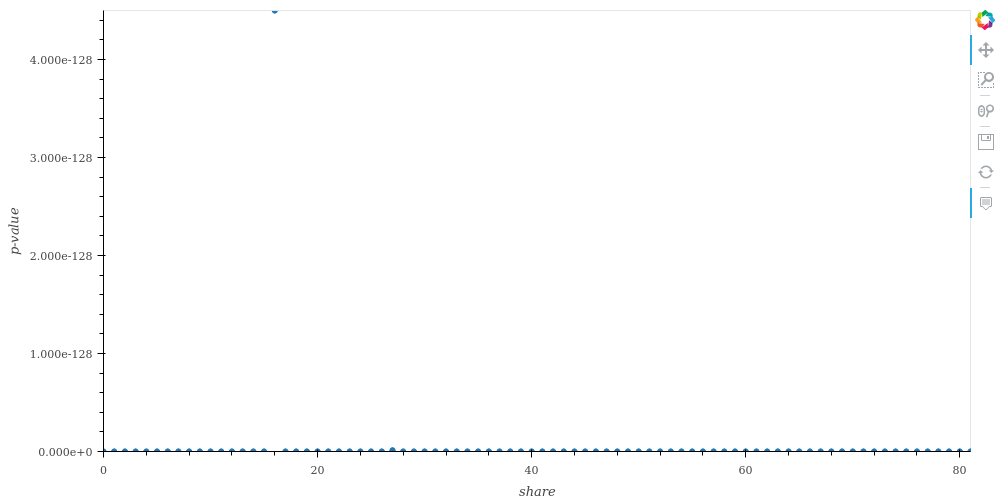  

__Figure 12: Scatter Plot of P-values for Portfolios of Blocking ANCOVA__
  
 
 
 
# Conclusion  
 
While the Capital Asset Pricing Model (CAPM) remains at the foreground of financial theory, empirical evidence suggests it is unreliable in markets which exhibit low forms of efficiency. In inefficient markets, investors are unable to achieve perfect diversification and as a result, may be subject to additional sources of unsystematic risk not predicted by the CAPM. This paper provides investors with an alternative risk metric known as Association Risk which offers investors a way in which to determine the level of diversification of a given portfolio without relying on inefficient price data.  Using Association Risk, investors can evaluate portfolio diversity using qualitative data.  
 
During periods of extreme inefficiency prices no longer incorporate all public or private information in the market.  If investors assume time-homogeneity in the statistical properties between shares over time in order to make investment decisions, the price inefficiencies render these assumptions inappropriate in evaluating medium and long-term portfolio risk.  Using Association Risk investors can incorporate information directly to evaluate the risk of a given portfolio in situations where price is misleading for continued risk management in times of crisis.  

This paper suggests the use of document-vectors as accurate and unbiased measures of firm-specific characteristics in identifying a holistic, unbiased and dynamic measure for use in determining unsystematic primary risk factors for use in portfolio construction. This metric provides a smooth and continuous mapping between companies and their industry or similarity to one another which goes beyond simple identification of “core-business” as used in the literature. It must be considered however that the word-vector representations pre-2009 are not robust due to the low volume of articles scraped. This remains a limitation of our study.

The results of this study confirm the relationship between the Association of shares within a portfolio on the Johannesburg Stock Exchange (JSE) and portfolio volatility. Firstly, using “Portfolio ANCOVA” this paper is able to identify the effects of Association on volatility over time and produce significant results. While we are confident that the coefficient on Association is not equal to zero, the extent to which the coefficients vary implies Association Risk inappropriate for use in predictive applications. Secondly, using a blocking experimental design, this paper finds strong evidence in identifying the relationship between Association and portfolio volatility when controlling for excessive systematic variance at points in time and contributions of variance by outlying high volatility shares.  

An opportunity for future research exists in which Association Risk could be used in predictive modelling, exploratory analysis, portfolio optimisation and risk-characterisation across indexes. Using this tool researchers may be able to quantify market efficiency over time better and develop existing methodologies for improved application in developing markets.  
 
\newpage
# Appendix  
 
## Appendix A: Definitions
 
### TFIDF   
 
TFIDF is an information retrieval technique that weighs a term’s frequency (TF) and its inverse document frequency (IDF). Each term has its respective TF, and IDF score and the product of the scores is the TFIDF weight of that term. The higher the score, the rarer the term and vice versa. This score is used to assign the importance of the term throughout the corpus. TFIDF is expressed as: 
     
$$W_{t,d} = TF_{t,d} log(N/DF_{t})$$
 
Where:  
- $TF_{t,d}$ is the number of occurrences of $t$ in document $d$.  
- $DF_{t}$ is the number of documents containing the term $t$.  
- $N$ is the total number of documents in the corpus.   
  
### Word2Vec  
The Word2Vec algorithm figures out how to place words on a “chart” in such a way that their location is determined by their meaning, called a vector-space. This means that words with similar meanings will be clustered together. I.e., Words with semantic relationships will be closer together than words without such relationships. Word2Vec is a three-layer neural network with an input, hidden and output layer. Word2Vec can utilise a Continuous Bag of Words (CBOW) or a Continuous Skip-gram Architecture. The use of the CBOW architecture, the Word2Vec algorithm we are using, is to learn word representations that can predict a word given its surrounding words. The input layer corresponds to signals for surrounding words and output layer correspond to signals for a predicted target word. Suppose, one has an input sentence: “The cat sat on the mat”. The aim is to learn representation for words “the”, ‘’cat”, “sat” etc. To this end, the neural network tries to learn features (weights) which look at words in a window, say “The cat sat” and try to predict the next word, “on”. Hence, with the input as “the”, ‘’cat”, ‘’sat”, the training process adjusts the weight of the network so that the probability of output “on” is maximised, as compared to other words in the vocabulary. As the training procedure repeats this process over a large number of sentences or phrases, the weights “stabilise”. These weights are then used as the vector representations of words.  
 

### Word2Vec Diagrams

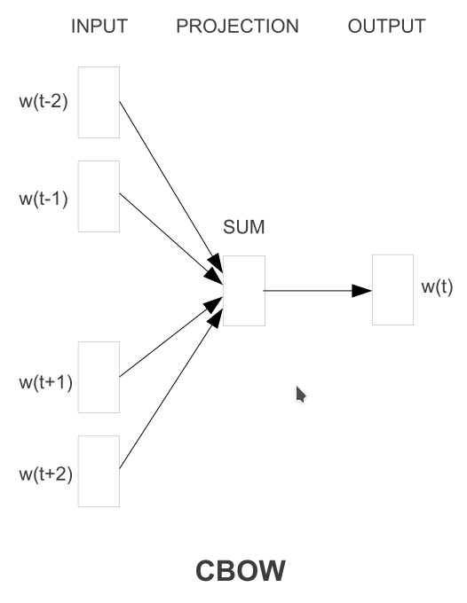

[@Mikolov2013a]  

In Figure 1, the CBOW architecture predicts the current word based on the context of a given word.  

 
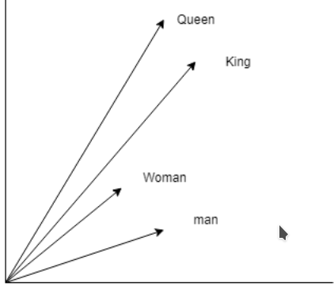  
 
In Figure 2, this diagram outlines the vector relationship maintained through the use of word embeddings.  
king - man + woman = queen  

 
### Negative Sampling  
 
Negative sampling is a method by which samples are drawn outside a given distribution.   In the context of Word2Vec and Doc2Vec embedding techniques, this involves sampling incorrect contexts for a given word or incorrect document tags for a given document to be used as false labels when training the embedding model.   
 
  
### LSI  
Latent Semantic Indexing (LSI) is a technique of analysing relationships between a set of documents and the terms they contain by producing a set of concepts related to the documents and terms. LSI assumes that words that are close in meaning will occur in similar pieces of text. A matrix containing word counts per paragraph is constructed from a large piece of text, and a mathematical technique called Singular Value Decomposition is used to reduce the number of rows while preserving the similarity structure among columns. Words are then compared by taking the cosine of the angle between the two vectors formed by any two rows. Values close to 1 represent very similar words while values close to 0 represent very dissimilar words.   
  
###  LDA   
Latent Dirichlet Allocation (LDA) is a generative statistical model that allows sets of observations to be explained by unobserved groups that explain why some parts of the data are similar. For example, an LDA model might have topics classified as finance-related and mining-related. Topics have probabilities of generating various words such as ore, gold, strikes which can be classified and interpreted by the viewer as mining-related. Likewise, the finance-related topic has probabilities of generating words commonly associated with finance. Words without relevance will have roughly equal probabilities. A lexical word may occur in several topics with a different probability but with a different typical set of neighbouring words in each topic. Each document is assumed to be characterised by a set of topics which makes the individual words exchangeable.  

### Doc2Vec  
Doc2Vec is an adaption of Word2Vec but instead of generating relationships between words it generates relationships between paragraphs, sentences, and documents. Again, there is a three-layer neural network with an input, a hidden and an output layer. The difference is that in the input layer there is now a signal for the document as well as the signals for surrounding words which is what makes the distinction between documents. The output layer, again, corresponds to signals predicting target words.  
  
### t-SNE  
t-distributed stochastic neighbour embedding (t-SNE) t-SNE is a tool to visualise high-dimensional data. It converts similarities between data points to joint probabilities and tries to minimise the Kullback-Leibler divergence between the joint probabilities of the low-dimensional embedding and the high-dimensional data. t-SNE has a cost function that is not convex, i.e. with different initialisations we can get different results.  
  
### SMACOF  
 
$$ \sigma(X) = \sum_{i<j<n} w_{i,j} (d_{i,j}(X)-\delta_{i,j})^2 $$
 
SMACOF uses an algorithm called majorizing to minimise stress functions. Strictly speaking, majorization is not an algorithm but rather an approach to constructing optimisation algorithms. The principle of majorization is to construct a surrogate function which majorizes/ minimises a particular function. In some optimisations problems, the objective-function is just too complicated to evaluate directly at every iteration. Surrogate functions are constructed to mimic most of the properties of the true objective-function, but that is much simpler analytically and computationally.   
  
## Appendix B: Benchmarking

A number of techniques remain popular within the literature of NLP. These include LDA, LSI, Doc2Vec and Word2Vec among others. In the following section, we analyse these four techniques and aim to visualise their data in order to assess their power in drawing association between companies on the JSE.

Models are first trained on a fixed dataset of company descriptions. Document-vectors are then computed using these various models representing each company. Two techniques were used in order to visualize these 100-dimensional document-vectors, namely t-distributed Stochastic Neighbour Embedding (t-SNE), a popular manifold embedding technique, and Scaling by Majorizing a Complicated Function (SMACOF), a self organizing map technique which uses a stress measure in order to create a lower dimensional representation of data which maintains the distances between document-vectors. Word2Vec is computed using Cosine Distances and Doc2Vec, LSI and LDA are computed using Euclidean distances.
   
One challenge in interpreting techniques is in benchmarking adequate tools for dimensionality reduction in order to visualise our 100-dimensional document-vectors.  The use of dimensionality reduction obfuscates some of the relationships between vectors.  For t-SNE, document-vectors are most accurate in their immediate neighbourhood due to the distributional assumption of the technique.  
 
In Figures 3 and 4, a scatter plot using Word2Vec is produced for all companies in our corpus with a random sampling of labels to aid in interpretation.  If we analyse the diagram, we see that telecommunications companies like Vodacom and MTN grouped, as well as mining companies like Gold Fields and Glencore.  A number of the insurance, property and finance companies are also close in proximity.  While many of the relationships in the diagram are not easily explainable, given the size of the dataset used, it is challenging for a reliable word-vector model to be estimated without the use of techniques such transfer-learning.  

 
When comparing Word2Vec against other techniques we see striking differences, seen in Figures 5 to 10. The first of which is that in techniques like LSI, we see far stronger clustering of companies with similar names or similar attributes or description. This is attributable primarily to the underlying methodology in which the Bag-of-Words is reduced in its dimensionality using some form of Principal Component Analysis (PCA) with little concern for polysemy. While similar limitations exist in techniques such as LDA, LDA Hierarchical Bayesian Estimation also lacks sufficient variation to distinguish sharply between companies.  
  
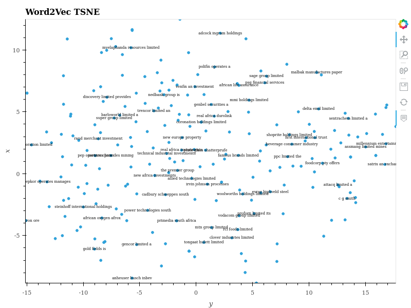  

__Figure 3: Word2Vec t-SNE__
  

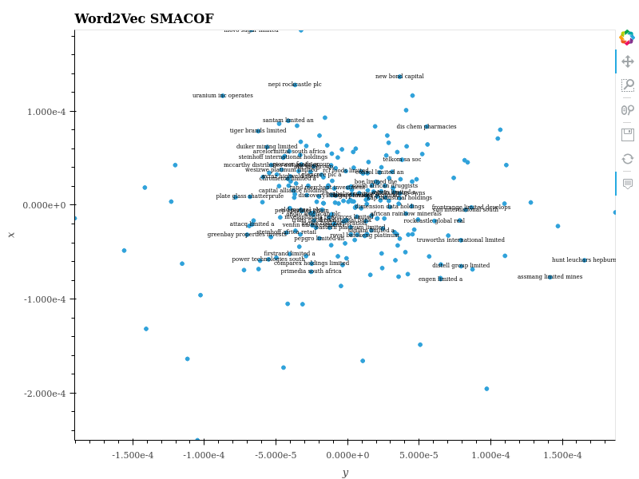  

__Figure 4: Word2Vec SMACOF__
  
  
When assessing Doc2Vec in Figures 5 and 6, we see the problem of excess noise from article words whose weighting cannot be reduced in the same way TFIDF does with Word2Vec, as TFIDF provides more stable and accurate word-vectors, given the size of the corpus.  
   
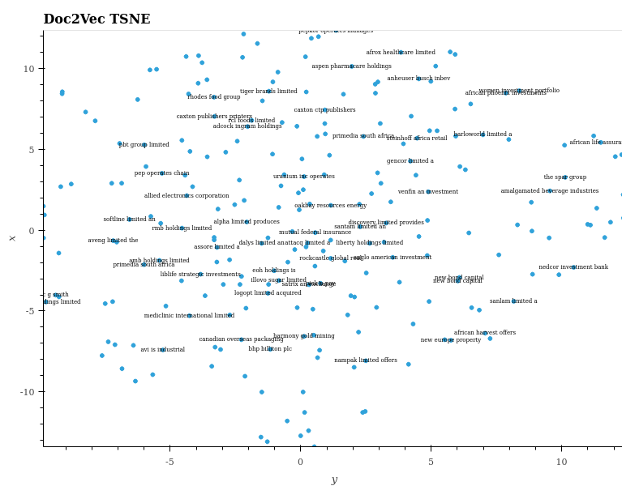  

__Figure 5: Doc2Vec t-SNE__
  
 
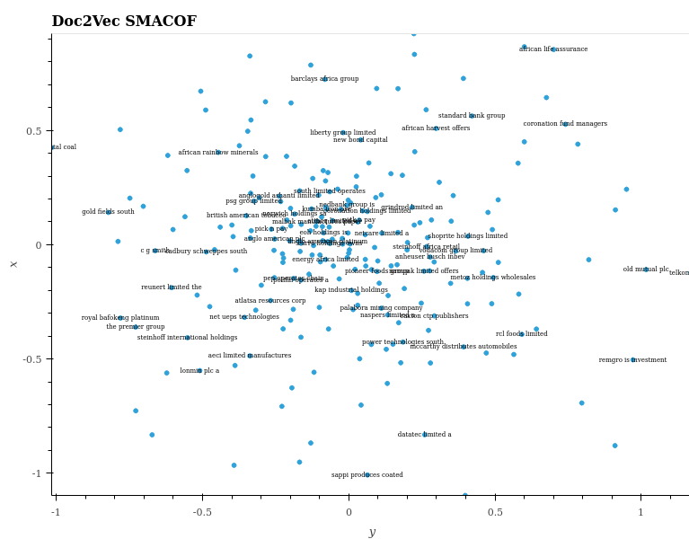  

__Figure 6: Doc2Vec SMACOF__
  
 
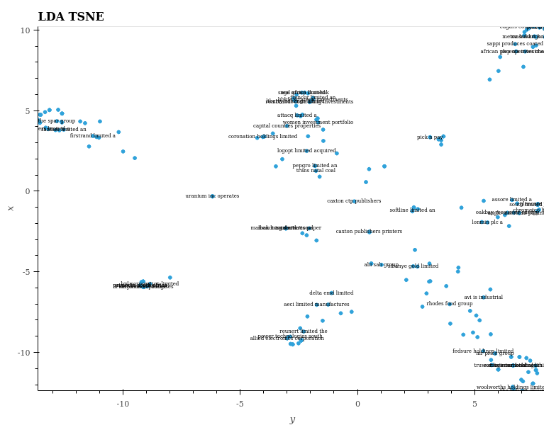  

__Figure 7: LDA t-SNE__
  
 
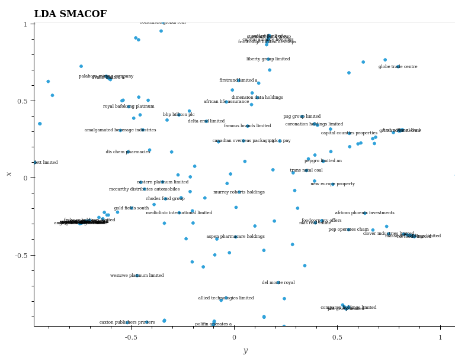

__Figure 8: LDA SMACOF__
   
 
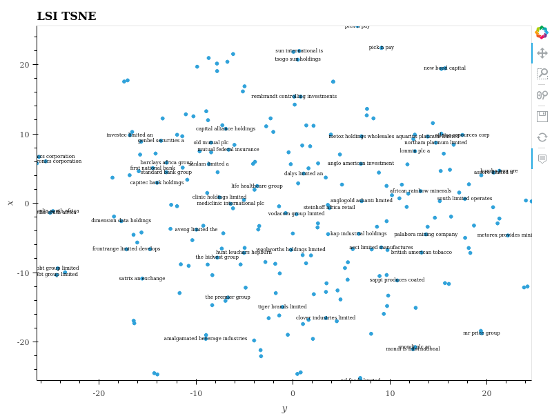  

__Figure 9: LSI t-SNE__
  
 
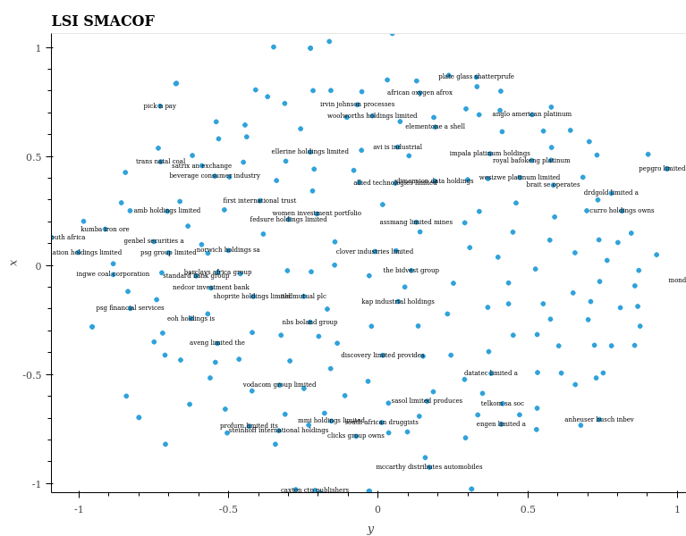  

__Figure 10: LSI SMACOF__
   
  
\newpage  
## Appendix C: News Sources  
| Number of Articles Sources |   Source               |  
|:------------------------------------|:-----------------------|  
| 88                                         | biznews                |  
| 63513                                   | businesslive          |  
| 146                                       | entrepreneurmag  |   
| 77492                                   | fin24                      |  
| 18884                                   | financialmail          |  
| 44                                         | iafrica                    |  
| 38262                                   | iol                          |  
| 100                                       | mg                         |  
| 9780                                     | moneyweb            |  
| 16439                                   | timeslive               |  
| 224748                                 | __total__              |  
  
## Appendix D: Companies in the analysis  
 
'ACL', 'AEG', 'AEL', 'AFE', 'AFX', 'AGL', 'AMS', 'ANG', 'APN', 'ARI', 'ASR', 'AVI', 'AXL', 'BAT', 'BAW', 'BGA', 'BIL', 'BVT', 'CAT', 'CLS', 'CML', 'CPI', 'DRD', 'DST', 'DSY', 'DTA', 'DTC', 'EOH', 'EXX', 'FBR', 'FSR', 'GFI', 'GND', 'HAR', 'HCI', 'IMP', 'INL', 'INP', 'IPL', 'KAP', 'LBH', 'LON', 'MMI', 'MRF', 'MRP', 'MSM', 'MTN', 'MUR', 'NED', 'NHM', 'NPK', 'NPN', 'NTC', 'OCE', 'OML', 'OMN', 'PBG', 'PIK', 'PPC', 'PSG', 'RCL', 'REM', 'RLO', 'RMH', 'SAP', 'SBK', 'SHP', 'SLM', 'SNH', 'SNT', 'SOL', 'SPG', 'SUI', 'TBS', 'TFG', 'TKG', 'TON', 'TRE', 'TRU', 'TSH', 'WBO' and 'WHL'.   
  
\newpage  
# References  
 
